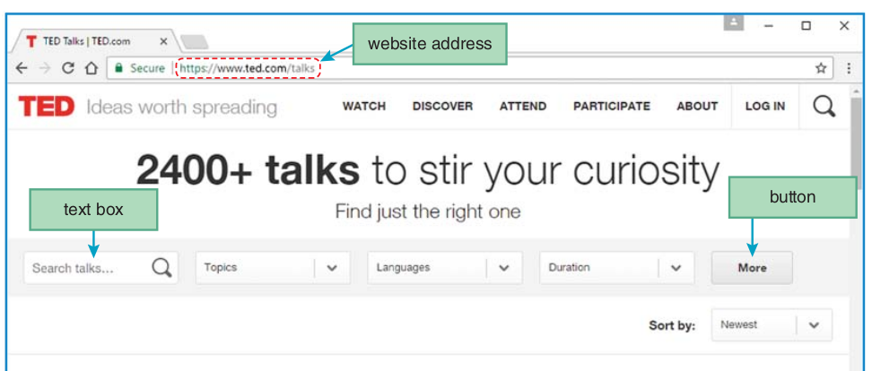
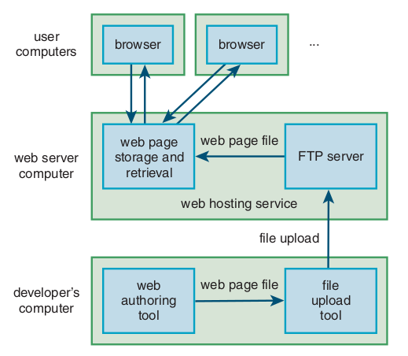
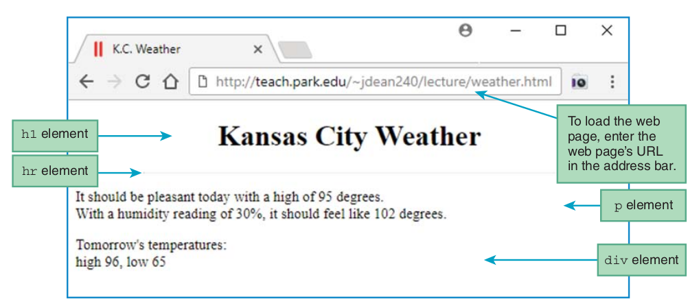
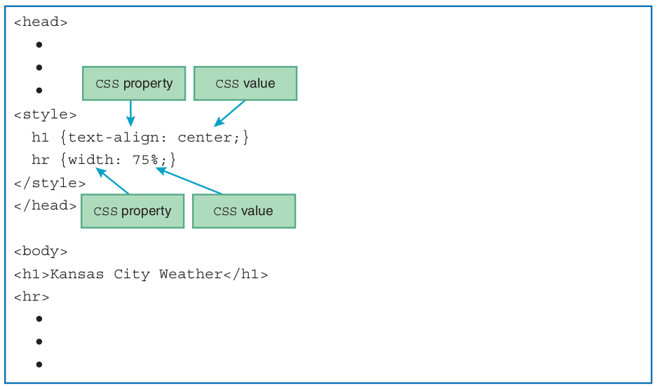
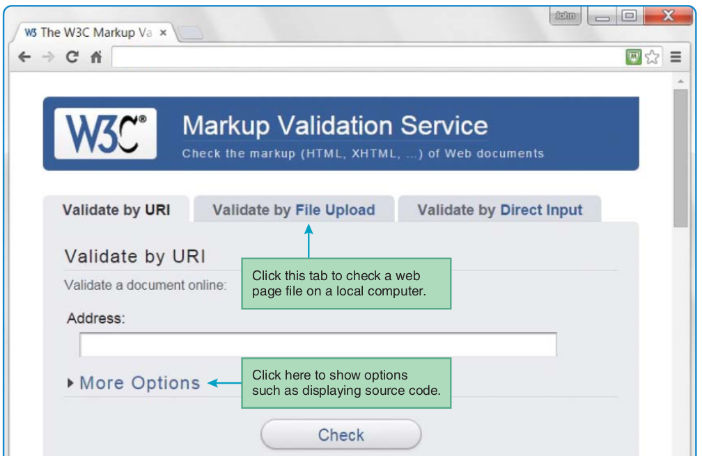

- A website is a collection of related web pages that are normally stored on a single web server computer.
- A web server is a computer system that enables users to access web pages stored on the web server’s computer. 




## Creating Website

To create a website, you’ll need these things:

1. a text editor
2. an upload/publishing tool
3. a web hosting service
4. a browser



- Webpage Example


- Demo-01.html
  - view source

- HTML Skeleton Code

```html
<!DOCTYPE html>
<html lang="en">
<head>
.
.
.
</head>
<body>
.
.
.
</body>
</html>
```

- HEAD Container

```html
<head>
<meta charset="utf-8">
<meta name="author" content="John Dean">
<meta name="description" content="Kansas city weather conditions">
<title>K.C. Weather</title>
</head>
```

- BODY Container

```html
<body>
<h1>Kansas City Weather</h1>
<hr>
<p>
It should be pleasant today with a high of 95 degrees.<br>
With a humidity reading of 30%, it should feel like 102 degrees.
</p>
<div>
Tomorrow's temperatures:<br>
high 96, low 65
</div>
</body>
```

- CSS Preview



## Check Validity

W3C’s HTML validation service


## You must read all tags description from 
`https://www.w3schools.com/`


